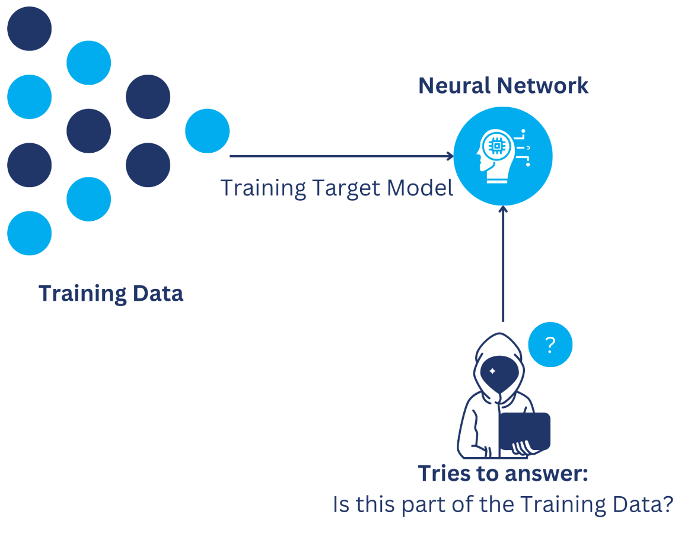
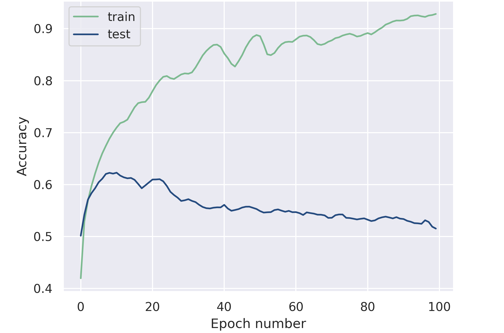
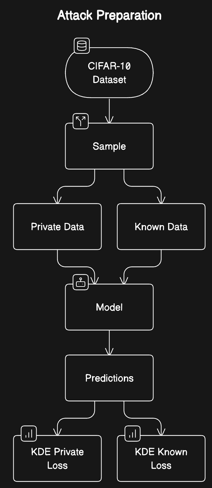
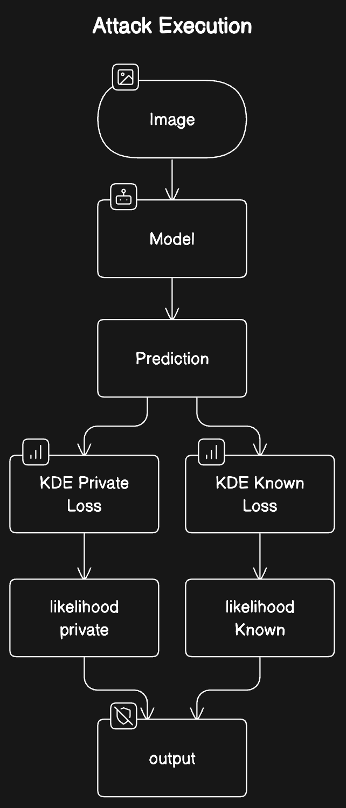
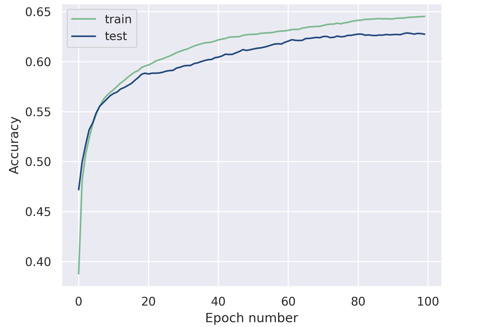

# Membership Inference Attack
> Nothing in life is to be feared, it is only to be understood. Now is the time to understand more, so we may fear less. - Marie Curie

---

## MIA - Membership Inference Attack

+ **Goal**: Check if a data sample was used as part of a model’s training set.
+ **Actors**:
  + Black/White Hat Hacker
  + Institutions
+ **Potential Uses**:
  + Guess the training set of a model.
  + Privacy Violation Detection.

---
## Example
1. Model is trained on patient data.
2. Attacker identifies a sample of the training set. By applying a MIA.
3. Attacker now has gained leaked information about patients who were present in the training set!!

---

## Research Background

+ **Attack Taxonomy**: black, grey and white box attack. Different levels of attacker advantage. [1]
+ **Shadow Models**: models trained to mimic the target model.
+ **Prediction Methods**: threshold classification, classifier neural net. [2]
+ **Prediction Input Data**: maximum class score, top-3 scores, entropy loss. [2] 
+ **Defense Methods**: Confidence Masking, Regularization, Differential Privacy, and Knowledge Distillation

---

## Attack Intuition

+ ML models are often overparameterized.
+ Overparameterization leads to different behavior on training data records (members) compared to test data records (non-members).
+ The finite size of training datasets and the repetitive nature of training epochs contribute to the model’s ability to memorize specific instances.

Consequently, the model’s parameters store statistically correlated information about individual training data records.

---

## Attack Procedure
1. Obtain access to a percentage of the dataset used in training the victim model and a separate dataset of private images not known to the model.
2. Record the prediction loss for each sample in both datasets.
3. Utilize a kernel density estimator (KDE) to derive the distribution of prediction loss for members and non-members of the training dataset.
4. Establish a threshold based on the distributions to classify samples as members or non-members.

---

## Defense

+ Confidence Masking
+ Regularization
+ Differential Privacy
+ Knowledge Distillation

---

# Implementation

> Quality is not an act, it is a habit.

---

## Data

*CIFAR-10*

+ 60000, 32x32 color images.
+ 10 total classes
+ 6000 images per class.

---
## Model Training
+ Architecture: LeNet-5
+ Training:
  + Adam Optimizer
  + 100 Epochs
+ Train `92.84%` accuracy.
+ Test `51.52%` accuracy.

---

## Attack Experimentation

+ Attack Preparation (left)
  + vary sampling percentage
  + vary loss function
    + probability loss
    + cross-entropy loss
    + normalized probability loss
+ Attack Execution (right)

---

## Defense

---

# Results

---

## Loss Sample
*Cross Entropy Loss Experiment:*

---

## Loss Sample
*Probability Loss Experiment:*

---

## Loss Sample
*Normalized Probability Loss Experiment:*

---

## Loss Distributions

*Cross Entropy Loss Experiment:*

---

## Loss Distributions

*Probability Loss Experiment:*

---

## Loss Distributions

*Normalized Probability Loss Experiment:*

---

---

---

---

## Confusion Matrix

*Cross Entropy Loss Experiment:*

---

## Confusion Matrix

*Probability Loss Experiment:*

---

## Confusion Matrix

*Normalized Probability Loss Experiment:*

---

## Discussion

---

## Conclusion

---
## References

[1] Nicholas Carlini, Steve Chien, Milad Nasr, Shuang Song, Andreas Terzis, and Florian Tramer. 2022. Membership inference attacks from first principles.
Dominik Hintersdorf, Lukas Struppek, and Kristian Kersting. 2023.
[2] To trust or not to trust prediction scores for membership inference attacks.
[3] Hongsheng Hu, Zoran Salcic, Gillian Dobbie, and Xuyun Zhang. 2021. Membership inference attacks on machine learning: A survey. CoRR, abs/2103.07853